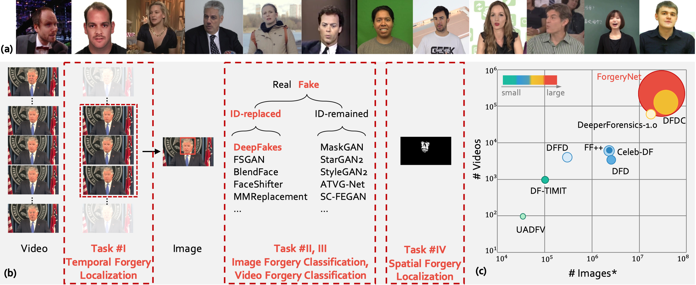
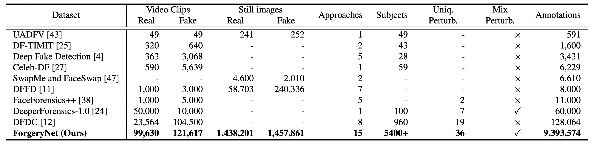

# *ForgeryNet*: A Versatile Benchmark for Comprehensive Forgery Analysis
<p align="center"> 

</p>

**ForgeryNet: A Versatile Benchmark for Comprehensive Forgery Analysis**
<p align="center"> 

</p>
[[arxiv](https://arxiv.org/abs/2103.05630)|[pdf](https://yinanhe.github.io/projects/doc/forgerynet.pdf)|[video](https://www.youtube.com/watch?v=e8XIL3Di2Y8)|[webpage](https://yinanhe.github.io/projects/forgerynet.html)]

[Yinan He](https://github.com/yinanhe), Bei Gan, [Siyu Chen](https://github.com/Siyu-C), [Yichun Zhou](https://github.com/TheshowN), [Guojun Yin](https://gjyin91.github.io), Luchuan Song, [Lu Sheng](https://lucassheng.github.io/), [Jing Shao](https://amandajshao.github.io), [Ziwei Liu](https://liuziwei7.github.io)

In CVPR 2021

> Abstract: The rapid progress of photorealistic synthesis techniques has reached at a critical point where the boundary between real and manipulated images starts to blur. Thus, benchmarking and advancing digital forgery analysis have become a pressing issue. However, existing face forgery datasets either have limited diversity or only support coarse-grained analysis. To counter this emerging threat, we construct the ForgeryNet dataset, an extremely large face forgery dataset with unified annotations in image- and video-level data across **four tasks**: 1) *Image Forgery Classification*, including two-way (real / fake), three-way (real / fake with identity-replaced forgery approaches / fake with identity-remained forgery approaches), and n-way (real and 15 respective forgery approaches) classification. 2) *Spatial Forgery Localization*, which segments the manipulated area of fake images compared to their corresponding source real images. 3) *Video Forgery Classification*, which re-defines the video-level forgery classification with manipulated frames in random positions. This task is important because attackers in real world are free to manipulate any target frame. and 4) *Temporal Forgery Localization*, to localize the temporal segments which are manipulated. ForgeryNet is by far the largest publicly available deep face forgery dataset in terms of data-scale (**2.9 million** images, **221,247** videos), manipulations (**7 image-level approaches, 8 video-level approaches**), perturbations (36 independent and more mixed perturbations) and annotations (**6.3 million** classification labels, **2.9 million** manipulated area annotations and **221,247** temporal forgery segment labels). We perform extensive benchmarking and studies of existing face forensics methods and obtain several valuable observations.
<p align="center"> 

</p>

## Updates
[07/2021] [The ForgeryNet Challenge 2021](https://competitions.codalab.org/competitions/33386) will start in July. 
[06/2021] Inference code has been released.

[05/2021] Training set and Validation set have been released.

---

## License and Citation
The use of this software is RESTRICTED to **non-commercial research and educational purposes**.
```
@article{he2021forgerynet,
  title={ForgeryNet: A Versatile Benchmark for Comprehensive Forgery Analysis},
  author={He, Yinan and Gan, Bei and Chen, Siyu and Zhou, Yichun and Yin, Guojun and Song, Luchuan and Sheng, Lu and Shao, Jing and Liu, Ziwei},
  journal={arXiv preprint arXiv:2103.05630},
  year={2021}
}
```
